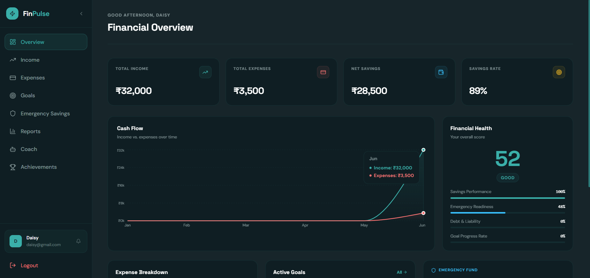

# 💰 FinPulse

### AI-Powered Personal Financial Health Platform

FinPulse is a full-stack personal finance management platform designed to help users track, understand, and improve their financial health.

Instead of focusing only on recording transactions, FinPulse brings **income tracking, expense management, savings analysis, financial goals, emergency fund monitoring, analytics, achievements, and AI-powered financial guidance** together in one platform.

---

## 🌟 Overview

Managing personal finances can become difficult when income, expenses, savings, goals, and financial decisions are handled separately.

**FinPulse** provides a centralized platform where users can:

- Track their income and expenses
- Monitor their savings
- Understand their spending patterns
- Set and track financial goals
- Monitor their emergency fund
- Analyze their financial performance
- Receive AI-powered financial guidance
- Track financial achievements
- Get an overall view of their financial health

The platform is designed to turn financial data into meaningful insights and help users make more informed financial decisions.

---

## ✨ Features

### 📊 Financial Dashboard

The dashboard provides a complete overview of the user's financial situation.

It includes:

- Total Income
- Total Expenses
- Total Savings
- Savings Rate
- Financial Health Score
- Financial Goal Progress
- Emergency Fund Status
- Financial summaries and insights

The dashboard allows users to understand their current financial position at a glance.

---

### 💵 Income Management

Users can record and manage their sources of income.

Features include:

- Add income
- View income records
- Track income over time
- Categorize income
- Analyze total income

---

### 💸 Expense Management

FinPulse allows users to record and monitor their spending.

Features include:

- Add expenses
- View expense records
- Categorize expenses
- Track spending
- Analyze expenses
- Monitor spending patterns

This helps users understand where their money is going and identify areas where spending can be improved.

---

### 🎯 Financial Goals

Users can create financial goals and monitor their progress.

Examples include:

- Saving for a laptop
- Building an emergency fund
- Saving for education
- Planning for a major purchase
- General savings goals

Users can track:

- Goal amount
- Current progress
- Remaining amount
- Progress percentage

This makes long-term financial planning easier and more visual.

---

### 📈 Financial Analytics

The analytics section helps users understand their financial behavior through data.

It provides insights into:

- Income
- Expenses
- Savings
- Spending patterns
- Financial trends

Analytics help transform raw financial data into information that users can use for better decision-making.

---

### 🤖 AI Financial Coach

FinPulse includes an AI-powered financial coaching feature.

The AI Coach is designed to provide users with financial guidance based on their financial information.

It can help users:

- Understand their financial situation
- Get personalized financial suggestions
- Identify areas for improvement
- Think through financial decisions
- Develop better financial habits

The AI component makes FinPulse more than a basic expense tracker by providing an interactive financial guidance experience.

---

### 🚨 Emergency Fund

FinPulse helps users monitor their emergency savings.

Users can track their emergency fund progress and understand how prepared they are for unexpected expenses.

This feature encourages users to maintain a financial safety net.

---

### 🏆 Achievements

FinPulse includes an achievement system to encourage positive financial habits.

Users can track financial milestones and achievements as they make progress toward their financial goals.

This introduces a motivational element to personal finance management.

---

### 🔐 Authentication

FinPulse includes user authentication and protected financial data.

Features include:

- User registration
- User login
- Authentication
- Protected routes
- Authentication middleware
- User-specific financial information

Each user's financial information is associated with their account.

---

## 🛠️ Technology Stack

### Frontend

- **React**
- **Vite**
- **JavaScript**
- **Tailwind CSS**
- **Axios**

### Backend

- **Node.js**
- **Express.js**
- **MongoDB**
- **Mongoose**

### Authentication & Security

- Authentication middleware
- JWT-based authentication
- Environment variables for sensitive configuration

### AI

- AI-powered financial assistance
- Backend AI integration

### Development Tools

- Git
- GitHub
- npm
- VS Code

---

## 🏗️ Architecture

FinPulse follows a full-stack architecture consisting of a React frontend, an Express.js backend, and a MongoDB database.

```text
                    ┌──────────────────────┐
                    │      FinPulse        │
                    │      Frontend        │
                    │       React          │
                    └──────────┬───────────┘
                               │
                               │ API Requests
                               ▼
                    ┌──────────────────────┐
                    │      Backend         │
                    │   Node.js + Express  │
                    └──────────┬───────────┘
                               │
              ┌────────────────┼────────────────┐
              │                │                │
              ▼                ▼                ▼
        ┌───────────┐   ┌─────────────┐   ┌────────────┐
        │ MongoDB   │   │    Auth     │   │ AI Services│
        │ Database  │   │ Middleware  │   │            │
        └───────────┘   └─────────────┘   └────────────┘
```

---

## 📂 Project Structure

```text
Finpulse/
│
├── backend/
│   │
│   ├── middleware/
│   │   └── auth.js
│   │
│   ├── models/
│   │   ├── User.js
│   │   └── index.js
│   │
│   ├── routes/
│   │   ├── ai.js
│   │   ├── analytics.js
│   │   ├── auth.js
│   │   ├── dashboard.js
│   │   ├── expenses.js
│   │   ├── goals.js
│   │   └── income.js
│   │
│   ├── backendusers.js
│   ├── server.js
│   ├── test-conn.js
│   ├── package.json
│   └── package-lock.json
│
├── frontend/
│   │
│   ├── public/
│   │   ├── favicon.svg
│   │   └── icons.svg
│   │
│   ├── src/
│   │   ├── api/
│   │   │   └── axios.js
│   │   │
│   │   ├── assets/
│   │   │   ├── hero.png
│   │   │   ├── react.svg
│   │   │   └── vite.svg
│   │   │
│   │   ├── components/
│   │   │   ├── layout/
│   │   │   │   ├── Layout.jsx
│   │   │   │   └── Sidebar.jsx
│   │   │   │
│   │   │   └── ui/
│   │   │       └── index.jsx
│   │   │
│   │   ├── context/
│   │   │   └── AuthContext.jsx
│   │   │
│   │   ├── hooks/
│   │   │   ├── useCounter.js
│   │   │   └── useInView.js
│   │   │
│   │   ├── pages/
│   │   │   ├── AICoach.jsx
│   │   │   ├── Achievements.jsx
│   │   │   ├── Analytics.jsx
│   │   │   ├── Dashboard.jsx
│   │   │   ├── Emergency.jsx
│   │   │   ├── Expenses.jsx
│   │   │   ├── Goals.jsx
│   │   │   ├── Home.jsx
│   │   │   ├── Income.jsx
│   │   │   ├── Login.jsx
│   │   │   └── Register.jsx
│   │   │
│   │   ├── utils/
│   │   │   └── helpers.js
│   │   │
│   │   ├── App.css
│   │   ├── App.jsx
│   │   ├── index.css
│   │   └── main.jsx
│   │
│   ├── eslint.config.js
│   ├── index.html
│   ├── package.json
│   ├── package-lock.json
│   ├── postcss.config.js
│   ├── tailwind.config.js
│   └── vite.config.js
│
├── .gitignore
├── package-lock.json
├── LICENSE
└── README.md
```

---

## ⚙️ Installation

### Prerequisites

Make sure you have the following installed:

* Node.js
* npm
* MongoDB / MongoDB Atlas
* Git

---

## 📥 Clone the Repository

Clone the project from GitHub:

```bash
git clone https://github.com/aleena-marie-thampi/Finpulse.git
```

Navigate into the project:

```bash
cd Finpulse
```

---

## 📦 Backend Setup

Navigate to the backend:

```bash
cd backend
```

Install the required dependencies:

```bash
npm install
```

Create a `.env` file inside the `backend` folder:

```env
PORT=5000
MONGODB_URI=your_mongodb_connection_string
JWT_SECRET=your_jwt_secret
GCP_API_KEY=your_api_key
```

Replace the placeholder values with your own configuration.

### Important

Never upload your `.env` file to GitHub.

Sensitive information such as:

* API keys
* Database connection strings
* JWT secrets
* Cloud credentials

should always be stored in environment variables.

---

## 🎨 Frontend Setup

Open a new terminal and navigate to the frontend:

```bash
cd frontend
```

Install dependencies:

```bash
npm install
```

If your frontend requires environment variables, create a local `.env` file and add the required configuration.

---

## ▶️ Running the Application

### Start the Backend

From the `backend` directory:

```bash
npm run dev
```

The backend will start on the configured port.

---

### Start the Frontend

From the `frontend` directory:

```bash
npm run dev
```

Vite will start the frontend development server.

The application will generally be available at:

```text
http://localhost:5173
```

---

## 🔐 Environment Variables

FinPulse uses environment variables to keep sensitive configuration secure.

### Backend

Example:

```env
PORT=5000
MONGODB_URI=your_mongodb_connection_string
JWT_SECRET=your_jwt_secret
GCP_API_KEY=your_api_key
```

### Frontend

Add the required frontend environment variables based on your local configuration.

> **Do not use real credentials in this README.**

The `.gitignore` file prevents `.env` files from being committed to the repository.

---

## 🔄 Application Flow

A typical user flow in FinPulse is:

```text
Register
   │
   ▼
Login
   │
   ▼
Dashboard
   │
   ├── Income
   │
   ├── Expenses
   │
   ├── Goals
   │
   ├── Analytics
   │
   ├── Emergency Fund
   │
   ├── Achievements
   │
   └── AI Coach
```

Users can enter their financial information and use the different sections to understand and manage their finances.

---

## 📊 Financial Health

One of the main goals of FinPulse is to provide users with an overall understanding of their financial health.

The platform considers financial information such as:

* Income
* Expenses
* Savings
* Savings rate
* Financial goals
* Emergency fund

This information is presented through the dashboard and analytics sections.

---

## 🤖 AI Financial Coach

The AI Coach is designed to make financial management more interactive.

Instead of requiring users to interpret all their financial information themselves, the AI component provides guidance based on the available financial context.

Potential use cases include:

* Understanding spending behavior
* Improving savings habits
* Planning toward financial goals
* Thinking through financial decisions
* Receiving personalized suggestions

---

## 🎯 Project Objective

The primary objective of FinPulse is to create a **centralized personal financial health platform** that combines financial tracking with analytics and intelligent guidance.

The project focuses on moving from:

```text
Raw Financial Data
        ↓
Financial Tracking
        ↓
Analytics
        ↓
Insights
        ↓
Better Financial Decisions
```

---

## 🚀 Future Enhancements

Some possible improvements for future versions include:

* Financial Decision Simulator
* Advanced budgeting tools
* Automated financial recommendations
* More detailed financial reports
* Improved AI financial planning
* Personalized monthly financial summaries
* Budget alerts
* Recurring transaction support
* More advanced data visualization
* Financial forecasting
* Mobile application
* Cloud deployment
* Improved gamification

---

## 🔒 Security Considerations

FinPulse uses environment variables for sensitive configuration.

The repository intentionally excludes:

```text
.env
.env.*
node_modules/
```

Sensitive credentials should never be committed to the repository.

Before deploying the application, make sure that:

* API keys are stored securely
* Database credentials are protected
* JWT secrets are strong
* Production environment variables are configured securely
* Debugging information is disabled in production

---

## 🧪 Development

During development, the project can be run using separate frontend and backend development servers.

### Frontend

```bash
cd frontend
npm run dev
```

### Backend

```bash
cd backend
npm run dev
```

---

## 📌 Technologies Used

| Technology   | Purpose                        |
| ------------ | ------------------------------ |
| React        | Frontend UI                    |
| Vite         | Frontend development and build |
| JavaScript   | Application logic              |
| Tailwind CSS | Styling                        |
| Axios        | API communication              |
| Node.js      | Backend runtime                |
| Express.js   | Backend API                    |
| MongoDB      | Database                       |
| Mongoose     | MongoDB object modeling        |
| JWT          | Authentication                 |
| Git          | Version control                |
| GitHub       | Repository hosting             |

---

## 💡 Why FinPulse?

Traditional expense trackers mainly answer:

> **"Where did my money go?"**

FinPulse aims to go a step further and help users answer:

> **"How healthy are my finances, and what can I do to improve them?"**

By combining tracking, analytics, goals, emergency fund monitoring, achievements, and AI-powered guidance, FinPulse provides a more complete view of personal financial health.

---

## 📸 Screenshots

Screenshots of the application can be added here to showcase the:

* Home page
* Dashboard
* Analytics
* Income management
* Expense management
* Goals
* Emergency fund
* AI Coach
* Achievements
* Login/Register pages

Example:

```markdown

```

---

## 🌐 Repository

**GitHub:**
[https://github.com/aleena-marie-thampi/Finpulse](https://github.com/aleena-marie-thampi/Finpulse)

---

## 👩‍💻 Author

### Aleena Marie Thampi

B.Tech Computer Science & Engineering

Interested in:

* Artificial Intelligence
* Machine Learning
* Full-Stack Development
* Web Development
* Software Development

---

## 📄 License

This project is licensed under the terms specified in the [LICENSE](LICENSE) file.

---

## ⭐ Acknowledgements

FinPulse was developed as a full-stack project to explore modern web development, backend API development, database management, authentication, analytics, and AI integration.

---

## ⭐ Support

If you find the project interesting, consider giving the repository a ⭐ on GitHub.

---

**FinPulse — Track. Understand. Improve. 💰**
